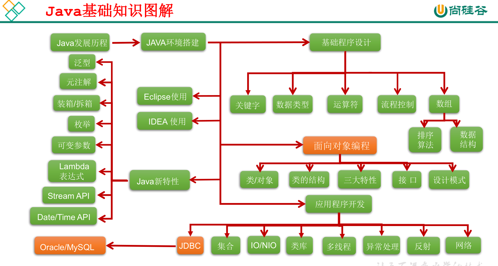
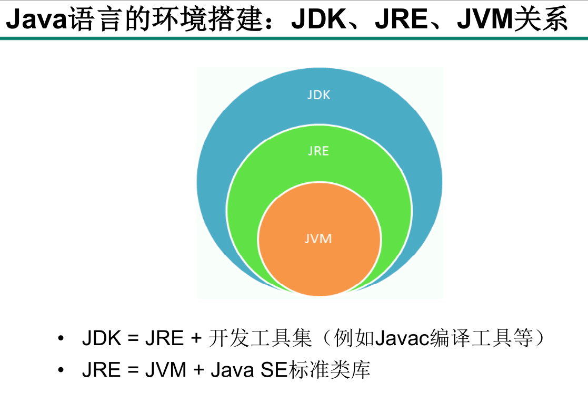
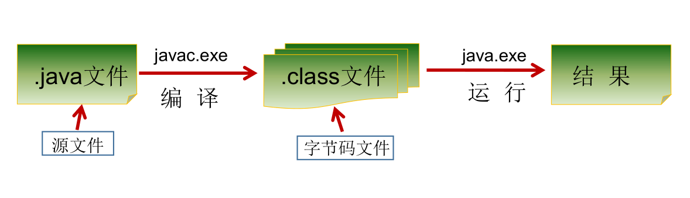

# Java笔记

## 第一章、Java语言概述
### 1、Java语言的特点
#### ①面向对象性
>两个要素：类、对象
>三个特征：封装、继承、多态
#### ②健壮性
>去除了C语言中的指针、自动的垃圾回收机制 -->仍然会出现内存溢出、内存泄漏
#### ③跨平台性
### 2、Java基础知识图解

### 3、JDK 、JRE 、JVM 关系

### 4、编译过程

### 3、Java注释
单行注释：//
多行注释：/\*    \*/
文档注释（java特有）：/\*\*    \*/
### 4、编程风格
 Java API 源代码选择了行尾风格
 '''Java
 public class Test {
    public static void main(String[] args){
        System.out.println("Block Style!");
    }
}
'''